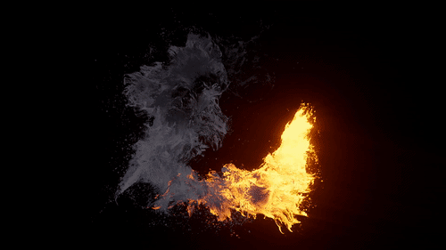

# needle-audioviz-scrubber

Video playhead scrubber driven by audio amplitude. Built in Unity with https://needle.tools

Demo: https://flax-elated-hole.glitch.me/

Video by Uzunov Rostislav https://www.pexels.com/video/animated-abstract-burning-effect-5091624/

Audio track is Crossy & Amplify - Rumpunch v2

## Concepts

- Audio playback and analysis, using threejs audio analyzer. 

- Image size handling relative to screen size

- Updating image texture source at runtime

- ImageReference?